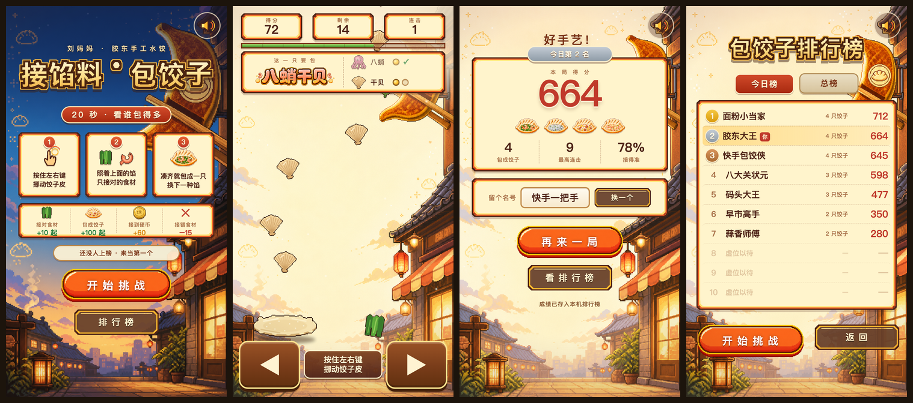

# 接馅料 · 包饺子

20 秒限时小游戏：按住左右键挪动饺子皮，接住天上掉的食材，凑齐配方就包成一只饺子。

**▶ 点这里直接玩：https://grapewang88-wq.github.io/liumama-dumpling-catch/**

手机、平板、电脑都能玩。电脑上也可以用键盘方向键。



---

## 怎么玩

1. **按住底部左右键**挪动饺子皮（电脑上也可以按 ← →）
2. 顶部会告诉你**这一只要包什么馅**，以及还缺哪些食材、各缺几个
3. 只接对的食材，凑齐就自动包成一只，然后换下一种馅
4. 20 秒结束，出分数并进排行榜

| 事件 | 分数 |
|---|---|
| 接对食材 | +10 起（连击最高 ×2.2） |
| 包成一只饺子 | +100 起（越难凑的馅分越高） |
| 接到 1 元硬币 | +60 |
| 接错食材 | −15，连击清零 |

六种馅取自胶东实打实的饺子馅：韭菜双虾、马蹄玉米鲜肉、茴香鸡蛋、萝卜丝脂渣、胶东鲅鱼、八蛸干贝。「鲜肉」被鲅鱼和玉米两个配方共用，是故意的，制造一点「这个到底该不该接」的判断。

第一次玩大概 200~400 分，熟手 600~900。

---

## 技术

纯前端单文件，无依赖、无构建、不联网。`index.html` 一个文件就是全部逻辑（约 1500 行），双击就能跑。

- 设计基准 1080×1920 竖屏，自动等比缩放铺满，非 9:16 的屏两边留黑边
- 排行榜存在浏览器 `localStorage`，只在本机
- 触摸和键盘都支持；两个方向键同时按会互相抵消，松开一个立刻跟着另一个走
- 页面不可见时游戏自动暂停（计时也停），切回来接着走

### 素材

`assets/items/`、`skin.png`、两张标题艺术字是 `素材加工.py` 用 Pillow 画的像素画：

- 食材和饺子皮：高倍超采样画形状 → 降到 40×40 像素网格 → 加 1px 深棕描边 → 整数放大 4 倍
- 标题艺术字：字体小尺寸渲染 → 二值化保证硬边 → 分层描边（深棕粗边 + 金色细边 + 硬投影）→ 整数放大 2 倍

```bash
python3 素材加工.py      # 重新生成上述素材
```

背景画、六种馅的饺子图、馅料名艺术字、音乐音效来自同系列的另外两款游戏，不是脚本生成的。

### 本地跑

```bash
python3 -m http.server 8000
```

然后开 http://localhost:8000 。直接双击 `index.html` 也能玩，只是个别浏览器在 `file://` 下不让写 localStorage，排行榜可能存不住。

---

## 这是什么项目的一部分

刘妈妈水饺 C1 售货机的营销小游戏，同系列第三款（前两款是「闻馅识饺子」和「煮饺子秘密特训」）。上机部署、运维面板、联网排行榜接口的说明见 [玩法与对接说明.md](玩法与对接说明.md)。

素材版权归项目方所有，这里公开只为方便试玩。
